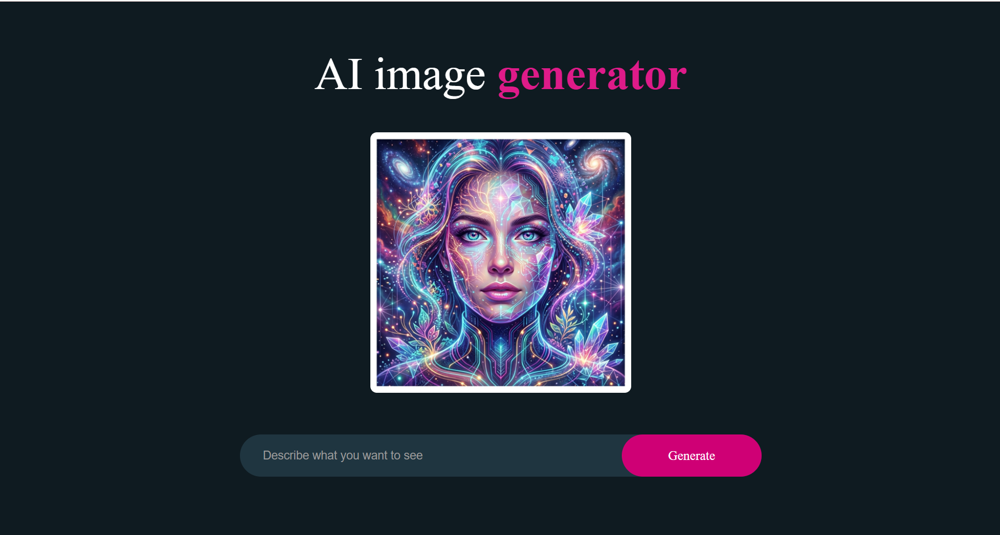
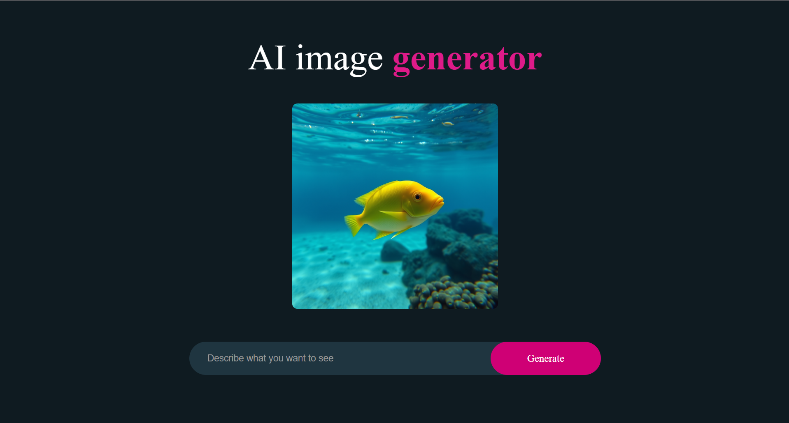

# 🤖 AI Image Generator

A simple **AI Image Generator** built with **React.js** that allows users to describe an image using a text prompt and generate an AI-generated image using the **Hugging Face Inference API**.

This project was created as a React practice project to learn **React state management, `useRef`, API integration, asynchronous functions, loading states, and dynamically displaying generated images**.

---

## 📸 Screenshots

### 🏠 Application



### ❌ False Search


### 🔃 Loading


### ✅ Result



---

## ✨ Features

- 📝 Enter a text prompt describing the desired image
- 🤖 Generate images using an AI image-generation model
- 🔗 Hugging Face Inference API integration
- ⏳ Animated loading bar while generating
- 🖼️ Display a default demo image before generation
- 🔄 Dynamically update the generated image
- 🧹 Automatically clear the prompt after successful generation
- ⚠️ Alert the user when the prompt is empty
- 🎨 Simple and clean user interface

---

## 🛠️ Technologies Used

- **React.js**
- **JavaScript (ES6+)**
- **CSS3**
- **Hugging Face Inference API**
- **Qwen Image**
- **Vite**
- **React Hooks**
  - `useState`
  - `useRef`

---

## 📂 Project Structure

```text
AI-Image-Generator/
│
├── public/
│
├── src/
│   ├── Assets/
│   │   └── demoImage.png
│   │
│   ├── Components/
│   │   └── ImageGenerator.jsx
│   │
│   ├── App.jsx
│   ├── App.css
│   ├── ImageGenerator.css
│   ├── index.css
│   └── main.jsx
│
├── .env
├── .gitignore
├── index.html
├── package.json
├── package-lock.json
└── vite.config.js
```

> Update the folder names above if your actual project structure is different.

---

## 🔄 How It Works

The application follows this flow:

```text
User enters a prompt
        ↓
prompt stored using useState
        ↓
User clicks "Generate"
        ↓
generateImage() is called
        ↓
Prompt is sent to Hugging Face
        ↓
Qwen/Qwen-Image generates the image
        ↓
Image Blob is returned
        ↓
URL.createObjectURL()
        ↓
Image URL stored in React state
        ↓
React displays the generated image
```

---

## 🧠 React Concepts Used

### `useState`

The application uses `useState` to manage:

```js
const [prompt, setPrompt] = useState("");
const [image, setImage] = useState("/");
const [loading, setLoading] = useState(false);
```

These states control:

- User's image prompt
- Currently displayed image
- Loading status

---

### `useRef`

A `useRef` is created using:

```js
const inputRef = useRef(null);
```

It provides a reference to a DOM element without causing a re-render when its value changes.

---

## 🤖 Hugging Face API Integration

The application uses the Hugging Face JavaScript SDK:

```js
import { InferenceClient } from "@huggingface/inference";
```

A client is created using the Hugging Face access token:

```js
const client = new InferenceClient(import.meta.env.VITE_HF_TOKEN);
```

The image is generated using:

```js
const imageBlob = await client.textToImage({
  model: "Qwen/Qwen-Image",
  inputs: prompt,
});
```

### Image Generation Flow

```text
prompt
  ↓
Hugging Face Inference API
  ↓
Qwen/Qwen-Image
  ↓
imageBlob
  ↓
URL.createObjectURL(imageBlob)
  ↓
imageUrl
  ↓
setImage(imageUrl)
  ↓

```

---

## ⏳ Loading Animation

While the image is being generated:

```js
setLoading(true);
```

The application changes the loading bar:

```jsx
<div className={loading ? "loading-bar-full" : "loading-bar"}></div>
```

When generation finishes:

```js
setLoading(false);
```

The loading bar returns to its initial state.

The loading text is also displayed only while the application is generating the image:

```jsx
<div className={loading ? "loading-text" : "display-none"}>Loading.....</div>
```

---

## 🖼️ Default Image

Initially, the image state is:

```js
const [image, setImage] = useState("/");
```

The application checks whether an image has been generated:

```jsx

```

Therefore:

```text
Before generation
        ↓
demoImage.png

After generation
        ↓
Generated AI image
```

---

## ⚠️ Empty Prompt Handling

The application prevents an API request when the user hasn't entered anything:

```js
if (!prompt.trim()) {
  alert("Describe something first to generate image");
  return 0;
}
```

This ensures that an empty prompt isn't sent to the AI model.

---

## 🔑 Environment Variable Setup

Create a `.env` file in the project root:

```env
VITE_HF_TOKEN=your_huggingface_access_token
```

The token is accessed in React using:

```js
import.meta.env.VITE_HF_TOKEN;
```

### `.gitignore`

Make sure `.env` is included in `.gitignore`:

```gitignore
.env
```

**Never commit your Hugging Face access token to GitHub.**

> Since this is a frontend-only React application, `VITE_HF_TOKEN` is ultimately included in the client-side bundle. This setup is suitable for learning and local practice, but a production application should keep API credentials on a backend.

---

## 📦 Installation

Clone the repository:

```bash
git clone https://github.com/your-username/AI-Image-Generator.git
```

Navigate to the project:

```bash
cd AI-Image-Generator
```

Install dependencies:

```bash
npm install
```

Install the Hugging Face SDK if it isn't already installed:

```bash
npm install @huggingface/inference
```

Create your `.env` file:

```env
VITE_HF_TOKEN=your_huggingface_access_token
```

Start the development server:

```bash
npm run dev
```

---

## 🚀 Usage

1. Open the application.
2. Enter a description in the search box.
3. Click **Generate**.
4. The loading animation will appear.
5. The prompt is sent to the Hugging Face model.
6. The generated image is displayed on the screen.
7. The prompt input is cleared after successful generation.

### Example Prompt

```text
A futuristic city at night with neon lights,
flying cars and a cyberpunk atmosphere
```

---

## 📚 What I Learned

Through this project, I practiced:

- React functional components
- `useState`
- `useRef`
- Controlled inputs
- Event handling
- Async/Await
- API integration
- Hugging Face Inference API
- Handling image Blob responses
- `URL.createObjectURL()`
- Conditional rendering
- Loading states
- Basic error prevention
- Environment variables
- Dynamic CSS classes

---

## 🔮 Future Improvements

Possible improvements for this project:

- [ ] Add image download functionality
- [ ] Add PNG/JPG download options
- [ ] Add better API error handling
- [ ] Add multiple image generation options
- [ ] Add image generation history
- [ ] Add prompt suggestions
- [ ] Add responsive design improvements
- [ ] Add different AI models
- [ ] Add a backend to securely handle API credentials

---

## 👨‍💻 Author

**Sayan Ali Mallick**

B.Tech CSE Student | Aspiring Software Engineer | MERN Stack Developer

---

## ⭐ Acknowledgement

- **React** — Frontend library
- **Vite** — Development and build tool
- **Hugging Face** — AI model inference platform
- **Qwen** — Image generation model

---

## 📄 License

This project is created for **educational and learning purposes**.
